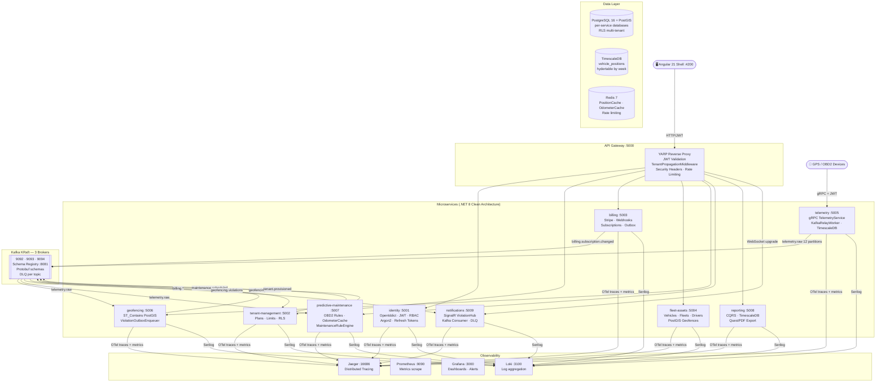

# FleetVision — B2B SaaS Fleet Telemetry Platform

[](https://dotnet.microsoft.com)
[](https://angular.io)
[](https://kafka.apache.org)
[](https://www.timescale.com)
[](https://postgis.net)
[](https://www.docker.com)
[](https://azure.microsoft.com)
[](LICENSE)

---

<details open>
<summary><h2>🇺🇸 English</h2></summary>

Multi-tenant B2B SaaS platform for commercial fleet telemetry — built on **10 .NET 8 microservices** (Clean Architecture), **Angular 21 with 7 Micro-Frontends** (Nx Native Federation), a 3-node **Kafka KRaft** cluster, **TimescaleDB** hypertables for GPS time-series data, **PostGIS** for real-time geospatial operations, and full deployment on **Azure Container Apps**. Based on architecture patterns from vehicle telemetry systems processing millions of events per day in production.

---

### System Architecture



---

### Microservices

| Service | Port | Responsibility | Tests |
|---------|------|---------------|-------|
| `gateway` | 5000 | YARP reverse proxy, JWT validation, TenantPropagation, security headers | — |
| `identity` | 5001 | OpenIddict JWT, Argon2 password hash, RBAC (4 roles), refresh token rotation | 34 |
| `tenant-management` | 5002 | Tenant onboarding, plan limits, internal plan-update API | 24 |
| `billing` | 5003 | Stripe subscriptions, webhook HMAC, BillingRelayWorker outbox | 29 |
| `fleet-assets` | 5004 | Vehicles, fleets, drivers, PostGIS geofences CRUD | 65 |
| `telemetry` | 5005 | gRPC ingestion, KafkaRelayWorker → `telemetry.raw`, TimescaleDB bulk insert | 62 |
| `geofencing` | 5006 | Kafka consumer, ST_Contains check, ViolationOutboxEnqueuer | 34 |
| `predictive-maintenance` | 5007 | OBD2 rules, odometer Redis INCRBYFLOAT, MaintenanceRuleEngine | 36 |
| `reporting` | 5008 | CQRS queries, TimescaleDB window functions, QuestPDF export | 15 |
| `notifications` | 5009 | SignalR ViolationHub, Kafka consumer, DLQ for corrupt messages | 16 |

**Total: 315+ unit tests · OWASP Top 10 audited · 37/37 smoke tests PASSED**

---

### Key Patterns

| Pattern | Where |
|---------|-------|
| **Outbox + FOR UPDATE SKIP LOCKED** | billing, geofencing, predictive-maintenance — guaranteed at-least-once delivery to Kafka |
| **Row-Level Security (RLS)** | All PostgreSQL tables with `tenant_id` — database-level tenant isolation |
| **TenantRlsInterceptor** | EF Core interceptor: `SET LOCAL app.tenant_id` per transaction |
| **TenantContextMiddleware** | JWT claim extraction only — no forgeable headers (fail-closed) |
| **Dead Letter Queue** | Every Kafka consumer has a `.dlq` topic for poison messages |
| **Manual Offset Commit** | `EnableAutoCommit = false` on all consumers — no data loss on restart |
| **Redis Dedup by Offset** | `odometer-inc:{tenantId}:{vehicleId}:{offset}` — exactly-once odometer increments |
| **Polly Standard Resilience** | HTTP clients in billing, geofencing, fleet-assets |

---

### Tech Stack

| Layer | Technology |
|-------|-----------|
| Backend | .NET 8 LTS · Clean Architecture (Domain / Application / Infrastructure / API) |
| API Gateway | YARP + TenantPropagationMiddleware + JWT validation |
| Identity | OpenIddict 5 · JWT HmacSha256 · RBAC · Argon2id |
| Messaging | Apache Kafka KRaft 3-node · Protobuf · Confluent Schema Registry |
| Telemetry DB | TimescaleDB 2 + PostGIS (hypertable partitioned by week) |
| Services DB | PostgreSQL 16 + PostGIS · database-per-service + RLS |
| Cache | Redis 7 (AOF persisted) · StackExchange.Redis |
| Frontend | Angular 21 · Nx · Native Federation · NgRx Signal Stores · Tailwind |
| Maps | Leaflet · real-time WebSocket markers and geofence polygons |
| Observability | OpenTelemetry → Jaeger · Prometheus · Grafana · Loki (Serilog) |
| Resilience | Polly v8 · Outbox pattern · DLQ Kafka |
| Billing | Stripe (subscriptions · webhooks · checkout sessions) |
| CI/CD | GitHub Actions (13 workflows) · Azure Container Apps · Bicep IaC |

---

### Quick Start (Dev)

**Prerequisites:** Docker 24+, Git

```bash
git clone https://github.com/cdgutierrez6/fleetvision.git
cd fleetvision

# 1. Set up environment
cp .env.example .env
# Edit .env — fill in POSTGRES_PASSWORD, TIMESCALE_PASSWORD,
# REDIS_PASSWORD, JWT_SIGNING_KEY (min 64 chars), GRAFANA_ADMIN_PASSWORD

# 2. Generate Kafka Cluster ID (required for KRaft mode)
docker run --rm confluentinc/cp-kafka:7.7.1 kafka-storage random-uuid
# Copy output to .env → KAFKA_CLUSTER_ID=<value>

# 3. Start all infrastructure + services
docker compose -f docker-compose.dev.yml up -d

# 4. Run smoke tests (37 checks)
.\infra\scripts\smoke-test.ps1
```

| UI | URL |
|----|-----|
| Angular Shell | http://localhost:4200 |
| Grafana | http://localhost:3000 |
| Jaeger | http://localhost:16686 |
| Prometheus | http://localhost:9090 |
| Schema Registry | http://localhost:8081 |

---

### Project Structure

```
fleetvision/
├── services/
│   ├── gateway/                     # YARP · security headers · OTel
│   ├── identity/                    # OpenIddict · JWT · RBAC
│   ├── tenant-management/           # Plans · limits · RLS
│   ├── billing/                     # Stripe · outbox · EF migrations
│   ├── fleet-assets/                # Vehicles · PostGIS geofences
│   ├── telemetry/                   # gRPC · TimescaleDB bulk insert
│   ├── geofencing/                  # ST_Contains · violation outbox
│   ├── predictive-maintenance/      # OBD2 rules · Redis odometer
│   ├── reporting/                   # CQRS · TimescaleDB · QuestPDF
│   └── notifications/               # SignalR · Kafka consumer · DLQ
├── frontend/                        # Nx workspace Angular 21
│   ├── apps/
│   │   ├── shell/                   # Host · router · auth guard
│   │   ├── mfe-fleet/               # Vehicle management dashboard
│   │   ├── mfe-monitoring/          # Real-time Leaflet map
│   │   ├── mfe-alerts/              # Live violation feed
│   │   ├── mfe-admin/               # Tenant superadmin
│   │   ├── mfe-reports/             # KPIs · analytics charts
│   │   └── mfe-billing/             # Subscription management
│   └── libs/shared/                 # models · data-access · ui
├── infra/
│   ├── db/                          # init-postgres.sql · init-timescale.sql · reporting-views.sql
│   ├── prometheus/                  # prometheus.yml
│   ├── loki/                        # loki-config.yml
│   ├── grafana/                     # provisioned datasources + dashboards
│   ├── bicep/                       # Azure Container Apps IaC
│   ├── k6/                          # Load test · ramping 10k pings/s
│   └── scripts/                     # smoke-test.ps1
├── proto/                           # Protobuf definitions (telemetry · geofencing)
├── docs/                            # Operational runbook
└── .github/workflows/               # 13 CI pipelines + cd-azure.yml
```

---

### Status

| Phase | Description | Status |
|-------|-------------|--------|
| F0 | Base infrastructure (Docker Compose, Kafka KRaft, TimescaleDB, PostGIS, Redis, OTel) | ✅ Done |
| F1 | Identity & Access + API Gateway — 34 tests | ✅ Done |
| F2 | Tenant Management + Billing Stripe — 53 tests | ✅ Done |
| F3 | Fleet & Assets CRUD PostGIS — 65 tests | ✅ Done |
| F4 | Telemetry gRPC + KafkaRelayWorker + TimescaleDB — 62 tests | ✅ Done |
| F5 | Geofencing ST_Contains + ViolationOutbox — 34 tests | ✅ Done |
| F6 | Predictive Maintenance OBD2 + Redis odometer — 36 tests | ✅ Done |
| F7 | Reporting CQRS + TimescaleDB + QuestPDF — 15 tests | ✅ Done |
| F8 | Notifications SignalR real-time — 16 tests | ✅ Done |
| F9 | Angular 21 frontend — 7 MFEs Nx Native Federation | ✅ Done |
| F10 | OTel all services + Polly + DLQ Kafka | ✅ Done |
| F11 | GitHub Actions CI/CD + Azure Bicep IaC + staging→prod gate | ✅ Done |
| F12 | Security headers, OWASP audit, k6 load test, runbook, smoke tests 37/37 PASSED | ✅ Done |

---

[LinkedIn](https://www.linkedin.com/in/cristian-daniel-guti%C3%A9rrez-segura) · [Portfolio](https://portafolio-frontend-wheat.vercel.app) · [cdgutierrez6@gmail.com](mailto:cdgutierrez6@gmail.com)

</details>

---

<details>
<summary><h2>🇨🇴 Español</h2></summary>

Plataforma SaaS B2B multi-tenant para telemetría de flotas comerciales — construida sobre **10 microservicios .NET 8** (Clean Architecture), **Angular 21 con 7 Micro-Frontends** (Nx Native Federation), cluster **Kafka KRaft** de 3 nodos, hypertables **TimescaleDB** para series de tiempo GPS, **PostGIS** para operaciones geoespaciales en tiempo real, y despliegue completo en **Azure Container Apps**. Basada en patrones de arquitectura de sistemas de telemetría vehicular que procesan millones de eventos diarios en producción.

---

### Arquitectura del Sistema


---

### Microservicios

| Servicio | Puerto | Responsabilidad | Tests |
|---------|--------|----------------|-------|
| `gateway` | 5000 | YARP reverse proxy, validación JWT, TenantPropagation, security headers | — |
| `identity` | 5001 | OpenIddict JWT, hash Argon2, RBAC (4 roles), rotación refresh tokens | 34 |
| `tenant-management` | 5002 | Onboarding de tenants, límites por plan, API interna actualización de plan | 24 |
| `billing` | 5003 | Suscripciones Stripe, HMAC webhook, BillingRelayWorker outbox | 29 |
| `fleet-assets` | 5004 | Vehículos, flotas, conductores, CRUD geofences PostGIS | 65 |
| `telemetry` | 5005 | Ingesta gRPC, KafkaRelayWorker → `telemetry.raw`, INSERT masivo TimescaleDB | 62 |
| `geofencing` | 5006 | Consumer Kafka, verificación ST_Contains, ViolationOutboxEnqueuer | 34 |
| `predictive-maintenance` | 5007 | Reglas OBD2, odómetro Redis INCRBYFLOAT, MaintenanceRuleEngine | 36 |
| `reporting` | 5008 | Queries CQRS, funciones de ventana TimescaleDB, export QuestPDF | 15 |
| `notifications` | 5009 | ViolationHub SignalR, consumer Kafka, DLQ para mensajes corruptos | 16 |

**Total: 315+ tests unitarios · Auditoría OWASP Top 10 · 37/37 smoke tests PASADOS**

---

### Patrones Implementados

| Patrón | Dónde |
|--------|-------|
| **Outbox + FOR UPDATE SKIP LOCKED** | billing, geofencing, predictive-maintenance — entrega at-least-once garantizada a Kafka |
| **Row-Level Security (RLS)** | Todas las tablas PostgreSQL con `tenant_id` — aislamiento de tenant a nivel de base de datos |
| **TenantRlsInterceptor** | Interceptor EF Core: `SET LOCAL app.tenant_id` por transacción |
| **TenantContextMiddleware** | Extracción solo desde claim JWT — sin headers falsificables (fail-closed) |
| **Dead Letter Queue** | Todo consumer Kafka tiene un topic `.dlq` para mensajes envenenados |
| **Manual Offset Commit** | `EnableAutoCommit = false` en todos los consumers — sin pérdida de datos al reiniciar |
| **Dedup Redis por Offset** | `odometer-inc:{tenantId}:{vehicleId}:{offset}` — incrementos de odómetro exactly-once |
| **Polly Standard Resilience** | Clientes HTTP en billing, geofencing, fleet-assets |

---

### Stack Tecnológico

| Capa | Tecnología |
|------|-----------|
| Backend | .NET 8 LTS · Clean Architecture (Domain / Application / Infrastructure / API) |
| API Gateway | YARP + TenantPropagationMiddleware + validación JWT |
| Identidad | OpenIddict 5 · JWT HmacSha256 · RBAC · Argon2id |
| Mensajería | Apache Kafka KRaft 3 nodos · Protobuf · Confluent Schema Registry |
| BD Telemetría | TimescaleDB 2 + PostGIS (hypertable particionado por semana) |
| BD por Servicio | PostgreSQL 16 + PostGIS · database-per-service + RLS |
| Cache | Redis 7 (AOF persistido) · StackExchange.Redis |
| Frontend | Angular 21 · Nx · Native Federation · NgRx Signal Stores · Tailwind |
| Mapas | Leaflet · marcadores WebSocket tiempo real y polígonos geofence |
| Observabilidad | OpenTelemetry → Jaeger · Prometheus · Grafana · Loki (Serilog) |
| Resiliencia | Polly v8 · Outbox pattern · DLQ Kafka |
| Billing | Stripe (suscripciones · webhooks · checkout sessions) |
| CI/CD | GitHub Actions (13 workflows) · Azure Container Apps · Bicep IaC |

---

### Quick Start (Dev)

**Prerequisitos:** Docker 24+, Git

```bash
git clone https://github.com/cdgutierrez6/fleetvision.git
cd fleetvision

# 1. Configurar entorno
cp .env.example .env
# Editar .env — completar POSTGRES_PASSWORD, TIMESCALE_PASSWORD,
# REDIS_PASSWORD, JWT_SIGNING_KEY (mín 64 chars), GRAFANA_ADMIN_PASSWORD

# 2. Generar Kafka Cluster ID (obligatorio para KRaft)
docker run --rm confluentinc/cp-kafka:7.7.1 kafka-storage random-uuid
# Copiar output en .env → KAFKA_CLUSTER_ID=<valor>

# 3. Levantar toda la infraestructura + servicios
docker compose -f docker-compose.dev.yml up -d

# 4. Correr smoke tests (37 verificaciones)
.\infra\scripts\smoke-test.ps1
```

| UI | URL |
|----|-----|
| Angular Shell | http://localhost:4200 |
| Grafana | http://localhost:3000 |
| Jaeger | http://localhost:16686 |
| Prometheus | http://localhost:9090 |
| Schema Registry | http://localhost:8081 |

---

### Estructura del Proyecto

```
fleetvision/
├── services/
│   ├── gateway/                     # YARP · security headers · OTel
│   ├── identity/                    # OpenIddict · JWT · RBAC
│   ├── tenant-management/           # Planes · límites · RLS
│   ├── billing/                     # Stripe · outbox · migraciones EF
│   ├── fleet-assets/                # Vehículos · geofences PostGIS
│   ├── telemetry/                   # gRPC · INSERT masivo TimescaleDB
│   ├── geofencing/                  # ST_Contains · outbox violaciones
│   ├── predictive-maintenance/      # Reglas OBD2 · odómetro Redis
│   ├── reporting/                   # CQRS · TimescaleDB · QuestPDF
│   └── notifications/               # SignalR · consumer Kafka · DLQ
├── frontend/                        # Workspace Nx Angular 21
│   ├── apps/
│   │   ├── shell/                   # Host · router · auth guard
│   │   ├── mfe-fleet/               # Dashboard gestión vehículos
│   │   ├── mfe-monitoring/          # Mapa Leaflet tiempo real
│   │   ├── mfe-alerts/              # Feed de violaciones en vivo
│   │   ├── mfe-admin/               # Superadmin de tenants
│   │   ├── mfe-reports/             # KPIs · gráficas analítica
│   │   └── mfe-billing/             # Gestión de suscripción
│   └── libs/shared/                 # models · data-access · ui
├── infra/
│   ├── db/                          # init-postgres.sql · init-timescale.sql · reporting-views.sql
│   ├── prometheus/                  # prometheus.yml
│   ├── loki/                        # loki-config.yml
│   ├── grafana/                     # datasources y dashboards provisionados
│   ├── bicep/                       # IaC Azure Container Apps
│   ├── k6/                          # Load test · ramping 10k pings/s
│   └── scripts/                     # smoke-test.ps1
├── proto/                           # Definiciones Protobuf (telemetry · geofencing)
├── docs/                            # Runbook operativo
└── .github/workflows/               # 13 pipelines CI + cd-azure.yml
```

---

### Estado

| Fase | Descripción | Estado |
|------|-------------|--------|
| F0 | Infraestructura base (Docker Compose, Kafka KRaft, TimescaleDB, PostGIS, Redis, OTel) | ✅ Completo |
| F1 | Identity & Access + API Gateway — 34 tests | ✅ Completo |
| F2 | Tenant Management + Billing Stripe — 53 tests | ✅ Completo |
| F3 | Fleet & Assets CRUD PostGIS — 65 tests | ✅ Completo |
| F4 | Telemetry gRPC + KafkaRelayWorker + TimescaleDB — 62 tests | ✅ Completo |
| F5 | Geofencing ST_Contains + ViolationOutbox — 34 tests | ✅ Completo |
| F6 | Predictive Maintenance OBD2 + Redis odometer — 36 tests | ✅ Completo |
| F7 | Reporting CQRS + TimescaleDB + QuestPDF — 15 tests | ✅ Completo |
| F8 | Notifications SignalR tiempo real — 16 tests | ✅ Completo |
| F9 | Angular 21 frontend — 7 MFEs Nx Native Federation | ✅ Completo |
| F10 | OTel todos los servicios + Polly + DLQ Kafka | ✅ Completo |
| F11 | GitHub Actions CI/CD + Bicep IaC Azure + gate staging→prod | ✅ Completo |
| F12 | Security headers, auditoría OWASP, k6 load test, runbook, smoke tests 37/37 PASADOS | ✅ Completo |

---

[LinkedIn](https://www.linkedin.com/in/cristian-daniel-guti%C3%A9rrez-segura) · [Portfolio](https://portafolio-frontend-wheat.vercel.app) · [cdgutierrez6@gmail.com](mailto:cdgutierrez6@gmail.com)

</details>

---

## License

MIT — Cristian Gutierrez © 2026
